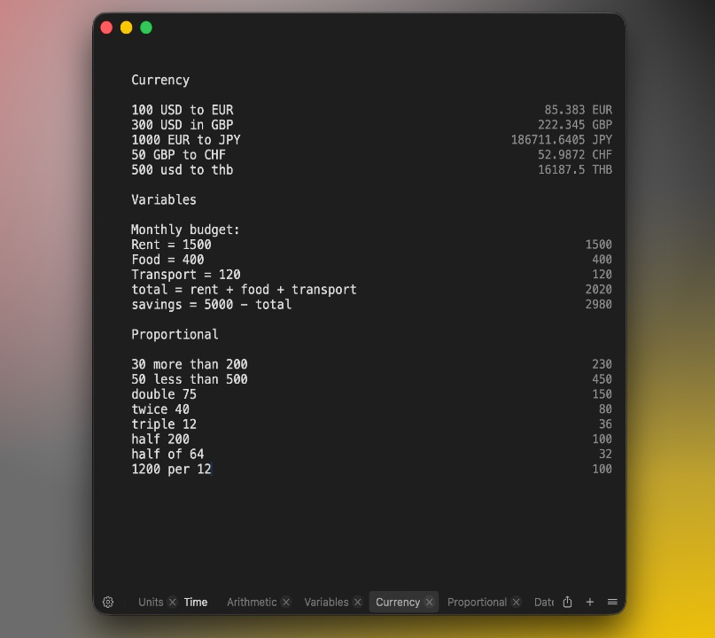
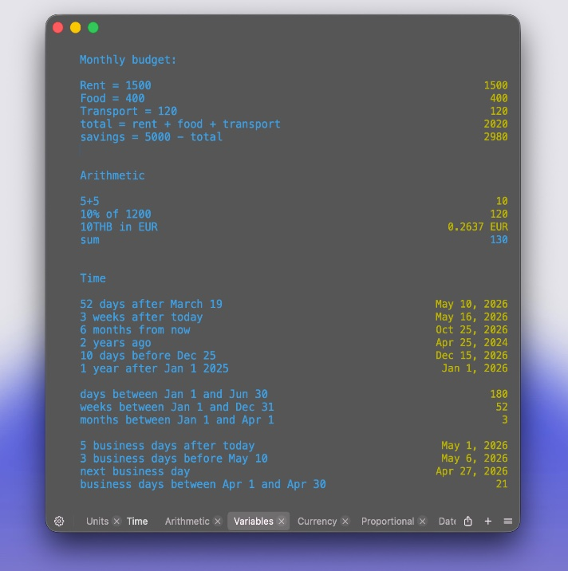
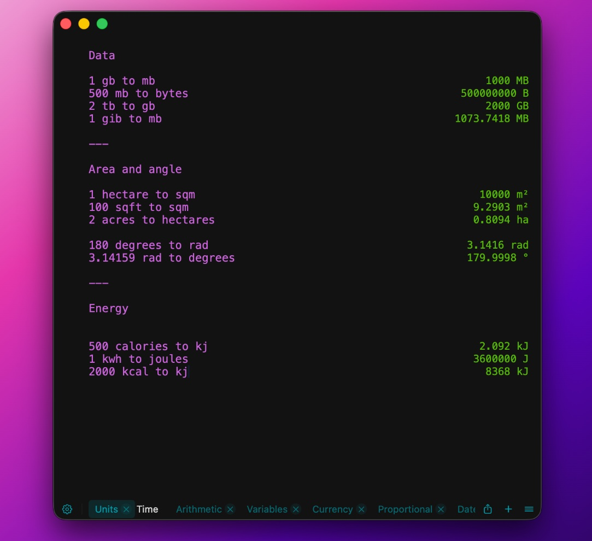

# Zahl

**A calculator that thinks the way you do.**

Zahl is a plain-text, natural-language calculator for macOS. Just type what you want to know — line by line, in plain English — and the answers appear instantly beside each line. No buttons, no formulas, no fuss. Every sheet is saved automatically, so your numbers are always right where you left them.

**[Visit the website](https://halebop17.github.io/zahl-app/)** · **[Read the full manual](https://github.com/halebop17/zahl-app/blob/main/manual.md)**

<p align="center">
  
</p>

---

## Numbers, the way you'd actually say them

Zahl understands the way people really think about numbers. Write `8 times 9`, `half of 64`, or `30 more than 200` — and Zahl just gets it. Mix words and operators freely. Use parentheses, percentages, or none at all.

```
20% of 80              → 16
80 + 20%               → 96
double 75              → 150
1200 per 12            → 100
```

---

## Build a budget. Plan a project. Sketch a quote.

Name your numbers and reuse them. Update one value, and everything that depends on it updates with you. It's the simplicity of a notepad, with the power of a spreadsheet — and none of the cells.

<p align="center">
  
</p>

---

## Convert anything

Travelling? Cooking? Shipping? Designing? Zahl converts between currencies, units, time zones, and dates — all in the same sheet, all in plain language.

- **Currencies** — `100 USD to EUR`, `500 GBP in JPY` (rates refresh automatically)
- **Length, mass, volume, temperature** — `5 km to miles`, `70 kg to lbs`, `100 °C to °F`
- **Data, area, energy, angles** — `1.5 GB to MB`, `2 acres to hectares`, `500 kcal to kJ`
- **Time zones** — `14:30 EST in Berlin`, `now in Tokyo`
- **Dates** — `today + 30 days`, `next Monday`, `business days between Apr 1 and Apr 30`

<p align="center">
  
</p>

---

## Organise the way you think

Use multiple sheets for different projects, ideas or trips. Rename them, rearrange them, close them — your work is autosaved as you go. Customise the colours and fonts to suit your mood, pin Zahl above your other windows, or summon it from anywhere with a global hotkey.

---

## Quick, quiet, and always there

Zahl stays out of your way. Open it, type, get your answer, move on. No accounts. No ads. No clutter. Just numbers that make sense.

---

**Zahl — for everyone who'd rather just write it down.**
